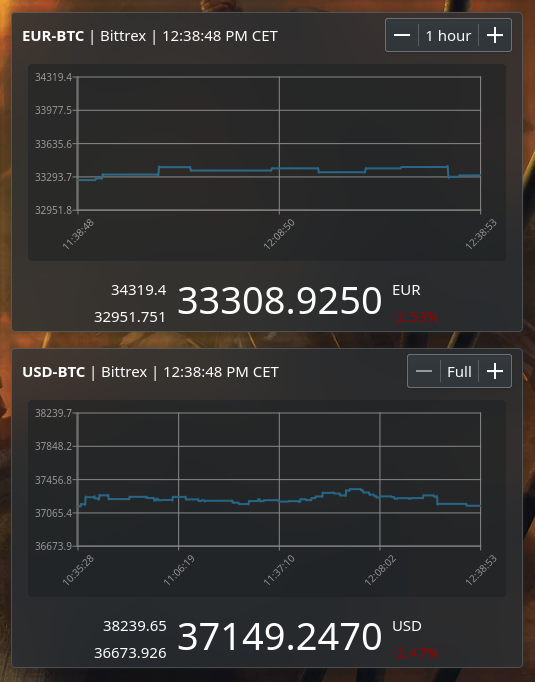

# Minotaur Charts Plasmoid
A KDE Plasma 5 Plasmoid for monitoring and charting cryptocurrency exchange rates on various exchanges.

This is a fork of [Minotaur plasmoid from jkcdarunday/minotaur-plasmoid](https://github.com/jkcdarunday/minotaur-plasmoid) adding chart drawing support. You can have both if you use the standalone-release branch or if you take the release once it's available :-)

**Requires Qt Charts**

**Please note that plot data is not fetched online, it is just being kept while the plasmoid is running.**

## Installation
To install manually, run the following while in repo directory:
```
kpackagetool5 -t Plasma/Applet --install plasmoid
```

To upgrade manually, run the following while in repo directory:
```
kpackagetool5 -t Plasma/Applet --upgrade plasmoid
```

## Testing
To test, run the following while in repo directory:
```
plasmoidviewer --applet plasmoid
```

## Screenshot

